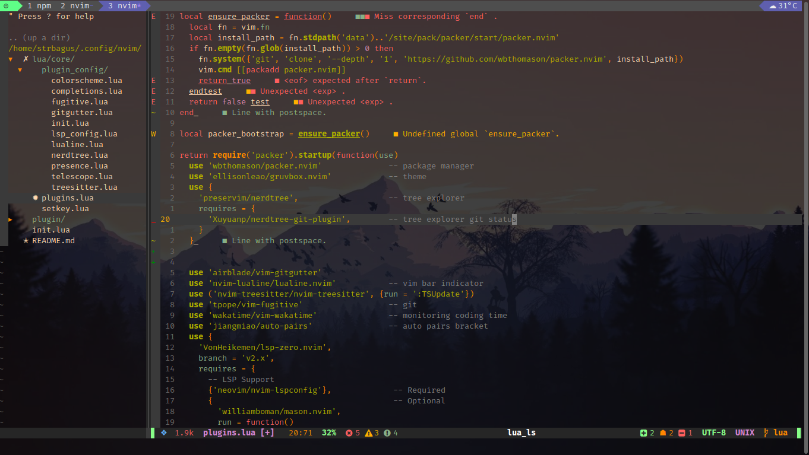

# MY NEOVIM
My own **NEOVIM** Configuration.

## Plugin Manager
- Packer: [wbthomason/packer](https://github.com/wbthomason/packer.nvim)

## Plugins 
-> Theme: [ellisonleao/gruvbox.nvim](https://github.com/ellisonleao/gruvbox.nvim)
-> File Exploler: [preservim/nerdtree](https://github.com/preservim/nerdtree)
	- Git Status: [Xuyuanp/nerdtree-git-plugin](https://github.com/Xuyuanp/nerdtree-git-plugin)
-> Inline Git Status: [airblade/vim-gitgutter](https://github.com/airblade/vim-gitgutter)
-> Status Bar: [nvim-lualine/lualine.nvim](https://github.com/nvim-lualine/lualine.nvim)
-> Language Support: [nvim-treesitter/nvim-treesitter](https://github.com/nvim-treesitter/nvim-treesitter)
-> Git Client: [tpope/vim-fugitive](https://github.com/tpope/vim-fugitive)
-> Time Monitoring: [wakatime/vim-wakatime](https://github.com/wakatime/vim-wakatime)
-> Auto Pairs Bracket: [jiangmiao/auto-pairs](https://github.com/jiangmiao/auto-pairs)
-> LSP: [VonHeikemen/lsp-zero.nvim](https://github.com/VonHeikemen/lsp-zero.nvim)
	 Support: 
		- [neovim/nvim-lspconfig](https://github.com/neovim/nvim-lspconfig)
		- [williamboman/mason.nvim](https://github.com/williamboman/mason.nvim)
		- [williamboman/mason-lspconfig.nvim](https://github.com/williamboman/mason-lspconfig.nvim)
	Autocompletion: 
		- [hrsh7th/nvim-cmp](https://github.com/hrsh7th/nvim-cmp)
		- [hrsh7th/cmp-nvim-lsp](https://github.com/hrsh7th/cmp-nvim-lsp)
		- [L3MON4D3/LuaSnip](https://github.com/L3MON4D3/LuaSnip)
-> Fuzy Finding File Exploler: [nvim-telescope/telescope.nvim](https://github.com/nvim-telescope/telescope.nvim)
-> Discord Presence: [andweeb/presence.nvim](https://github.com/andweeb/presence.nvim)

